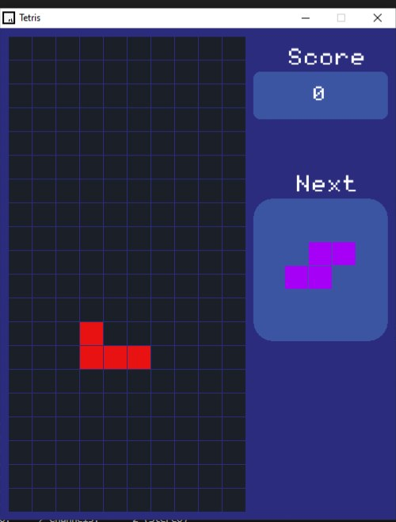

# 🎮 Tetris (C++ & Raylib)

A classic **Tetris** game built using **C++** and the **Raylib** graphics library.

---

## ✨ Features
- Classic Tetris gameplay  
- Smooth 2D graphics  
- Score system  
- Next piece preview  
- Game over detection  

---

## 🛠️ Built With
- C++
- Raylib

---

## 🎮 Controls
- Arrow Keys → Move / Rotate  
- Esc → Exit  

---

## 📸 Screenshots

